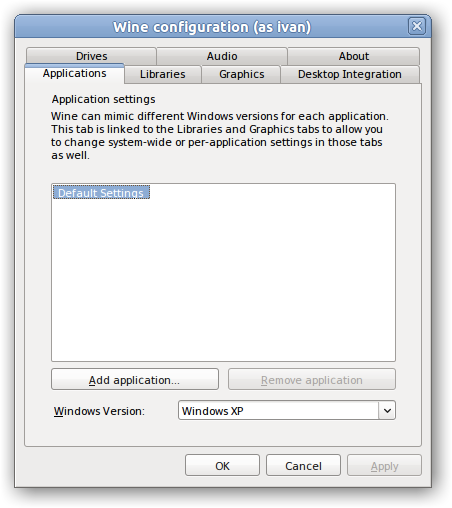
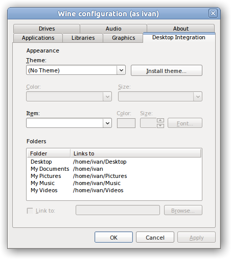
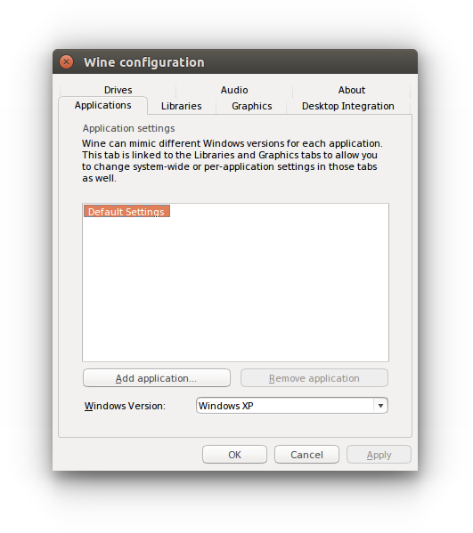
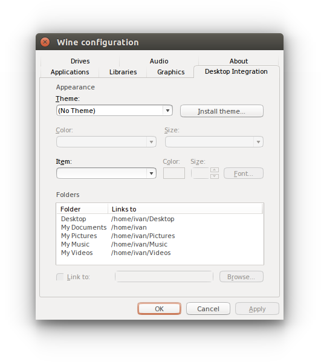

# UxThemeGTK

UxThemeGTK is a wrapper around the GTK+ rendering engine implementing the standart Windows
[Visual Styles API](https://msdn.microsoft.com/en-us/library/windows/desktop/bb773187.aspx).
This can help you to make your Wine applications looking really native in GNU/Linux
(see the screenshots below).

## Installation

(Tested in Ubuntu 14.10)

1.  Make sure you have the following packages installed:

    ```bash
    $ sudo apt-get install git libgtk-3-dev wine1.6-dev
    ```

2.  Get the sources:

    ```bash
    $ git clone https://github.com/akulinchev/uxthemegtk.git
    ```

3.  Now you need to compile it.

    ```bash
    $ cd uxhtemegtk
    $ make
    ```

4.  Find `uxtheme.dll.so`. There may be more than one!

    ```bash
    $ find /usr/lib -name "uxtheme.dll.so"
    /usr/lib/i386-linux-gnu/wine/uxtheme.dll.so
    /usr/lib/x86_64-linux-gnu/wine/uxtheme.dll.so
    ```

5.  Don't forget to make a backup!

    ```bash
    $ sudo cp /usr/lib/x86_64-linux-gnu/wine/uxtheme.dll.so /usr/lib/x86_64-linux-gnu/wine/uxtheme.dll.so.old
    ```

6.  Copy the binary you have compiled at the step 3 in the directory you
    have found at the step 5.

    ```bash
    $ sudo cp uxtheme.dll.so /usr/lib/x86_64-linux-gnu/wine/uxtheme.dll.so
    ```

7.  Enjoy it!

    ```bash
    $ wine64 winecfg
    ```

## Troubleshooting

UxThemeGTK is an experimental software. If you found a bug,
[let me know](https://github.com/akulinchev/uxthemegtk/issues/new).

## Screenshots








